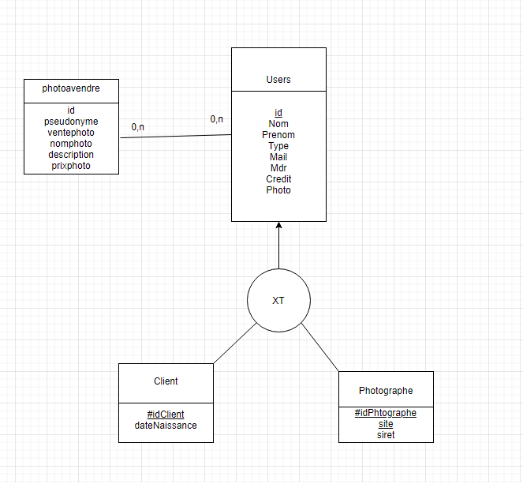
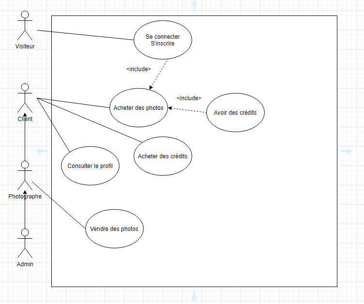

# PhotoForYou : site pour la vente et l'achat de photos d'Artistes

### Présentation de la société

PhotoForYou est un site web de vente de photo . Il permet aux photographes professionnels disposant de plusieurs sirets de pouvoir mettre en ligne leurs photographies au prix qu'ils ont défini. Les clients pourront acheter les images qu'ils souhaitent grâce à un système de crédit mis en place sur le site. Le site fait un profit pour chaque photo vendue.

---

## Expression fonctionelle du besoin

### Objectifs
+ Vente et achat de photographies.
+ Attirer de nouveaux clients. Augmenter le CA et les bénéfices. 

### Cibles et caractéristiques
+ Vendeurs : photographes d’auteur (travaillant avec la société ou pas).
+ Acheteur : magasine, journaux, industriels, particuliers, ...

### Description du contenu

- Enregistrement sur le site en tant que photographe ou client.
- La désinscription (cela entraine la perte des crédits et pour un photographe et le retrait de toutes ses photos du catalogue)
- Catalogue des photos à vendre classer par catégorie.
- Photos en promotion ou photos vedettes (les plus regardés ou qui correspondent au contexte) en première page.
- Moteur de recherche rapide, avancé/multicritères
- Gestion du caddie
- Les photos achetées sont archivées chez le client et téléchargeables à tous moments
- Mise en place automatique d’un filigrane lors de la mise en ligne de photo.
- Le photographe fixe le prix de vente en nombre de crédit. (minimum 2 crédits-maximum 100 crédits)
- Les photos sont en vente de manière exclusive (un seul achat après retrait du catalogue)
- L’achat se fait à partir de crédits que l’on doit acheter. 
(1 crédit = 5 euros)

### Planning & coût

## Exigences fonctionnelles

1. Principales composantes
- Gestion des utilisateurs
- Identification des utilisateurs
- Gestion de l'espace client/photographe
- Gestion des commandes
- Gestion de paiements
- Gestion du catalogue
- Moteur de recherche

2. Fonctionnalités en "front office"
- Identification
- Catalogue des photos
- Gestion de l'espace photographe
- Gestion de l'esapce clien
- Gestion des commandes
- Catalogue des photos

3. Fonctionnalités en "back-office"
- Gestion des utilisateurs
- Gestion du contenu informationnel
- Gestion du catalogue

## MLD
- users (<ins>id</ins>, nom, prenom, email, type, mdp, credit, photo);
- photoavendre (<ins>id</ins>, pseudonyme, ventephoto, nomphoto, descriptionphoto, prixphoto);

## SCD

## Diagramme de cas d'utilisation

## Truc à Faire

## Truc important fait

